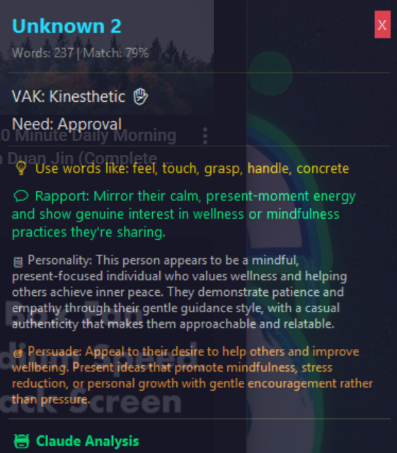

# Audio Profiler

Real-time audio profiling system that captures speech, identifies speakers, and analyzes linguistic patterns to build behavioral profiles.

## Preview

<p align="center">
  
  
</p>

## Features

- **Real-time Audio Capture** - Capture system audio or microphone input
- **Speaker Identification** - Voice embedding-based speaker recognition using pyannote.audio
- **Speech Transcription** - Whisper-based speech-to-text
- **Linguistic Analysis**:
  - VAK Modality (Visual/Auditory/Kinesthetic communication preferences)
  - Social Needs profiling (significance, approval, acceptance, intelligence, power, pity)
  - Decision style detection
  - Communication pattern analysis
- **Claude AI Integration** - Deep personality analysis after 200+ words
- **Real-time Overlay** - Transparent always-on-top window showing live profiling
- **Speaker Management** - Merge, rename, and track speakers across sessions

## Installation

```bash
# Clone the repo
git clone https://github.com/alanwatts07/Profiler.git
cd Profiler

# Install dependencies
pip install -r requirements.txt

# Copy and configure environment
cp .env.example .env
# Edit .env with your API keys
```

### Required API Keys

1. **HuggingFace Token** (for speaker diarization)
   - Get from: https://huggingface.co/settings/tokens
   - Accept model licenses:
     - https://huggingface.co/pyannote/speaker-diarization-3.1
     - https://huggingface.co/pyannote/segmentation-3.0
     - https://huggingface.co/pyannote/wespeaker-voxceleb-resnet34-LM

2. **Anthropic API Key** (optional, for Claude analysis)
   - Get from: https://console.anthropic.com

## Usage

### List Audio Devices
```bash
python -m src.cli record devices
```

### Real-time Overlay (Recommended)
```bash
python -m src.cli overlay --device 27
```
This opens a transparent overlay showing:
- Current speaker identification
- VAK modality (Visual/Auditory/Kinesthetic)
- Dominant social need
- Communication tips
- Claude AI personality insights (after 200+ words)

### Record and Analyze
```bash
python -m src.cli record start --device 27
# Press Ctrl+C to stop and process
```

### Analyze Text Directly
```bash
python -m src.cli analyze "Your text here"
```

### Speaker Management
```bash
# List all speakers
python -m src.cli speakers all

# Interactive management (rename, merge, delete, view)
python -m src.cli speakers manage

# Merge duplicate speakers
python -m src.cli speakers merge 5 3  # merge #5 into #3

# Register a voice for recognition
python -m src.cli speakers register "John" --device 27
```

### Export Data
```bash
# Export speaker profile
python -m src.cli export speaker "John" --format json

# Export session transcript
python -m src.cli export session abc123 --format txt

# Dump all sessions
python -m src.cli dump
```

## Windows Setup (System Audio)

To capture system audio on Windows:

1. **Option A: Stereo Mix**
   - Right-click speaker icon → Sound Settings → Sound Control Panel
   - Recording tab → Right-click → Show Disabled Devices
   - Enable "Stereo Mix"

2. **Option B: VB-Audio/Voicemeeter** (Recommended)
   - Install Voicemeeter: https://vb-audio.com/Voicemeeter/
   - Route audio through Voicemeeter
   - Use Voicemeeter Output as recording device

## Project Structure

```
Profiler/
├── src/
│   ├── audio/
│   │   ├── audio_capture.py     # Audio input handling
│   │   ├── audio_processor.py   # Whisper transcription
│   │   └── speaker_identifier.py # Voice embeddings & diarization
│   ├── profiling/
│   │   ├── linguistic_analyzer.py # VAK, social needs, patterns
│   │   ├── behavioral_profiler.py # Profile aggregation
│   │   └── pattern_data.py        # Linguistic markers
│   ├── storage/
│   │   ├── database.py          # SQLAlchemy setup
│   │   └── models.py            # Database models
│   ├── cli.py                   # Command-line interface
│   ├── overlay.py               # Real-time GUI overlay
│   └── config.py                # Configuration
├── data/                        # Database & voice embeddings
├── .env.example                 # Environment template
└── requirements.txt
```

## How It Works

1. **Audio Capture** - Captures audio chunks from selected device
2. **Speaker Identification** - Extracts voice embeddings, matches against known speakers
3. **Transcription** - Whisper converts speech to text
4. **Linguistic Analysis** - Detects VAK markers, social need indicators, decision patterns
5. **Profile Building** - Accumulates scores across sessions for each speaker
6. **Claude Analysis** - After 200+ words, sends text to Claude for deeper personality insights

## License

MIT
